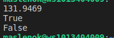
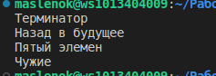
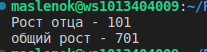
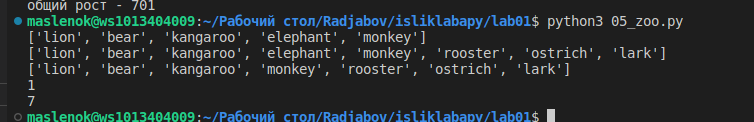
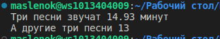
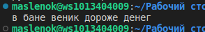
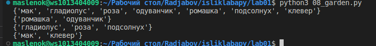
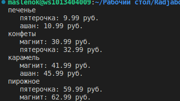
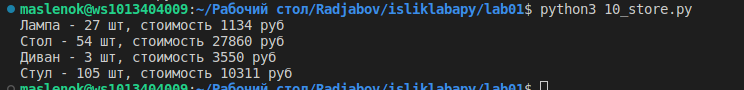

# ЗАДАНИЕ 00_distance.py
--------
#### Задание: Рассчитать расстояние между городами, составить словарь и вывести на экран

С помощью формулы ((x1 - x2) ** 2 + (y1 - y2) ** 2) ** 0.5 рассчитаем дистанцию от одного города до другого

###### Результат
>```
>{'Moscow': {'London': 145.6, 'Paris': 130.38}, 'London': {'Moscow': 145.6, 'Paris': 42.43}, 'Paris': {'Moscow': 130.38, 'London': 42.43}}
>```


# ЗАДАНИЕ 01_circle.py
----
#### Задание:
1. Вывести на консоль значение прощади данного круга с точностю до 4-х знаков после запятой;
2. Вывести на консоль True, если точка point лежит внутри круга, False - не лежит;
3. Аналогично для другой точки (point_2)




# ЗАДАНИЕ 02_operations.py
----
#### Задание: Расставьте знаки операций "плюс", "минус", "умножение" и скобки между числами "1 2 3 4 5" так, что бы получилось число "25".
```python
res = (1+2+3)*4+5
print(res) 
```


# ЗАДАНИЕ 03_favorite_movies.py
----
#### Задание:  Выведите на консоль с помощью индексации строки, последовательно: первый фильм последний второй второй с конца



# ЗАДАНИЕ 04_my_family.py
----
#### Задание:  Выведите на консоль рост отца в формате и Выведите на консоль общий рост вашей семьи как сумму ростов всех членов


# ЗАДАНИЕ 05_zoo.py
----
#### Задание:посадите медведя (bear) между львом и кенгуру и выведите список на консоль, добавьте птиц из списка birds в последние клетки зоопарка и выведете, уберите слона и выведите список на консоль, выведите на консоль в какой клетке сидит лев (lion) и жаворонок (lark). Номера при выводе должны быть понятны простому человеку, не программисту.



# ЗАДАНИЕ 06_songs_list.py
----
#### Задание:распечатайте общее время звучания трех песен: 'Halo', 'Enjoy the Silence' и 'Clean' в формате Три песни звучат ХХХ.XX минут,  распечатайте общее время звучания трех песен: 'Sweetest Perfection', 'Policy of Truth' и 'Blue Dress' А другие три песни звучат ХХХ минут



# ЗАДАНИЕ 07_secret.py
----
#### Задание:Нужно его расшифровать и вывести на консоль в удобочитаемом виде. Должна получиться фраза на русском языке, например: как два байта переслать.



# ЗАДАНИЕ 08_garden.py
----
#### Задание: создайте множество цветов, произрастающих в саду и на лугу garden_set =, meadow_set = , выведите на консоль все виды цветов ,  выведите на консоль те, которые растут и там и там , выведите на консоль те, которые растут в саду, но не растут на лугу, выведите на консоль те, которые растут на лугу, но не растут в саду



# ЗАДАНИЕ 09_shopping.py
----
#### Задание: Создайте словарь цен на продкты следующего вида (писать прямо в коде). Указать надо только по 2 магазина с минимальными ценами



# ЗАДАНИЕ 10_store.py
----
#### Задание: Рассчитать на какую сумму лежит каждого товара на складе например для лампывести стоимость каждого вида товара на складе: один раз распечать сколько всего столов и их общая стоимость, один раз распечать сколько всего стульев и их общая стоимость, и т.д. на складе Формат строки <товар> - <кол-во> шт, стоимость <общая стоимость> руб


Шпаргалочка:
1) git add .
2) git status
3) git commit -m 'jxj'
4) git push

Шпаргалочка:
1) git add .
2) git status
3) git commit -m 'jxj'git 
4) git push